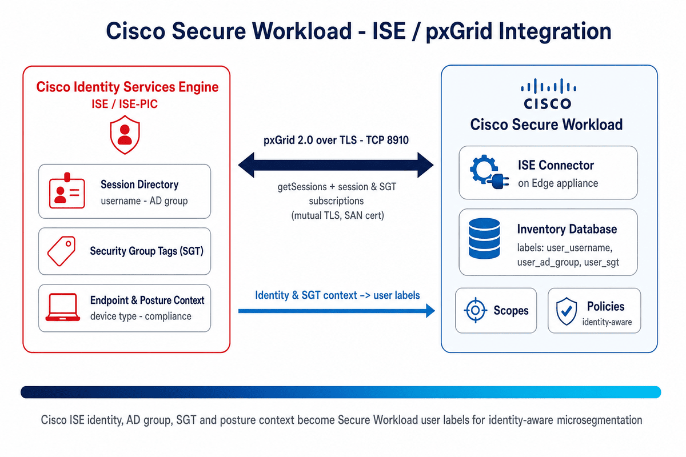

# Cisco Secure Workload → ISE / pxGrid Integration Guide


A step-by-step integration guide for connecting **Cisco Secure Workload (CSW)** to **Cisco Identity Services Engine (ISE / ISE-PIC)** over **pxGrid 2.0** to enable **user-identity–aware microsegmentation**. ISE session, AD-group, **SGT**, and posture context become CSW **user labels** — so policy can follow the user, not just the IP.

[](https://www.cisco.com/go/secureworkload)
[](https://www.cisco.com/c/en/us/support/security/identity-services-engine/series.html)
[](https://www.cisco.com/c/m/en_us/products/security/secure-workload-compatibility-matrix.html)

> **⚠ Disclaimer:** This is a **community reference guide** prepared by Cisco Solutions Engineering — not an official Cisco product document. Always refer to the [official Cisco Secure Workload documentation](https://www.cisco.com/c/en/us/support/security/tetration/series.html) and [Cisco ISE documentation](https://www.cisco.com/c/en/us/support/security/identity-services-engine/series.html) for authoritative, release-specific guidance.

---

## What This Integration Provides

| Without ISE | With ISE |
|-------------|---------|
| Policies based on IP addresses | Policies based on **user**, **AD group**, **SGT**, **posture** |
| Static scope membership | **Dynamic scopes** — follow the user regardless of IP |
| No VPN/remote user context | Full identity context for roaming and VPN endpoints |

---

## What This Covers

| Area | Detail |
|---|---|
| **Integration type** | ISE connector — **identity/inventory enrichment** (runs on the CSW **Edge appliance**) |
| **Mechanism** | **pxGrid 2.0** (WebSocket/REST): `getSessions` API + subscriptions to the **session** and **Security Group Label** topics |
| **Data imported** | Session identity (username, AD group), **SGT**, endpoint & posture context — registered as ISE agents |
| **Transport** | pxGrid over **TLS**, **TCP 8910** (mutual TLS; ISE pxGrid node needs a **SAN** certificate) |
| **Refresh** | Endpoint/SGT **snapshot every 20 h**; **user labels every 2 min**; optional **LDAP snapshot every 24 h** |
| **Enforcement** | **None** — this is identity **enrichment only**; no SGACL/policy is pushed back to ISE |
| **Result** | `user/*` and `device/*` labels for identity-aware scopes and policies |
| **Verified against** | CSW **3.7+** (SAN cert required); ISE **2.4+** or ISE-PIC **3.1+**; pxGrid **2.0** |

---

## Quick Start

### Prerequisites
- ISE **2.4+** or ISE-PIC **3.1+** with **pxGrid 2.0** enabled (pxGrid 1.0 / XMPP is end-of-life)
- CSW **3.7+** — ISE pxGrid node certificate must include **Subject Alternative Names (SAN)**
- A **pxGrid client certificate** for the CSW connector, signed by the **same CA** as the pxGrid node
- CSW **Edge appliance** deployed and registered (ISE connector runs on Edge)
- **TCP 8910** open: Edge appliance → ISE pxGrid node
- (Optional) LDAP/AD reachable for additional `user/*` attribute enrichment

### Steps (summary)

**On Cisco ISE:**
1. Enable **pxGrid** and confirm the pxGrid node **SAN certificate** (Administration → System → Certificates)
2. Generate the CSW **pxGrid client** CSR (OpenSSL), have your **CA sign** it, export the signed PEM chain

**On Cisco Secure Workload:**
1. `Manage → Virtual Appliances` → select the **Edge appliance**
2. **Connectors** → **+ Add Connector** → **ISE**; add ISE instance(s) with hostname/nodename + pxGrid certs
3. Create an **Agent Remote VRF Configuration** covering the endpoint subnet(s)
4. (Optional) add **LDAP** config → **Test and Apply**; approve the pxGrid client in ISE if prompted

**Verify:**
1. Connector shows **Status: Active**; endpoints register as **ISE agents**
2. `Inventory → Workloads` — search an endpoint IP and confirm `user/*` / `device/*` labels
3. Build an identity-aware scope, e.g. `user/ad_group = Finance-Analysts`

See the [full step-by-step guide](CSW-ISE-Integration-Guide.md) or [open the HTML version](CSW-ISE-Integration-Guide.html) for detailed instructions.

---

## Video References

> **Legend:** 🎬 video · 📘 guide · 📄 doc

| Reference | What it shows |
|---|---|
| [🎬 CSW User Education video library](https://github.com/chandrapati/CSW-User-Education) | Curated Secure Workload concept explainers and walkthroughs |
| [📘 ISE / pxGrid Integration Guide](CSW-ISE-Integration-Guide.md) | This repo's full step-by-step deployment guide |
| [📄 Cisco docs — ISE Connector](https://www.cisco.com/c/en/us/td/docs/security/workload_security/secure_workload/user-guide/4_0/cisco-secure-workload-user-guide-on-prem-v40/configure-and-manage-connectors-for-secure-workload.html) | Authoritative connector behavior, pxGrid, certs, and limits |

---

## Architecture Diagram



*The ISE connector on the CSW Edge appliance subscribes to ISE over pxGrid 2.0 (TLS, TCP 8910), pulling session identity, AD group, SGT, and posture context, and publishes them as `user/*` and `device/*` labels for identity-aware scopes and policies.*

---

## Files in This Repo

| File | Description |
|---|---|
| [`README.md`](README.md) | This file — quick start and overview |
| [`CSW-ISE-Integration-Guide.md`](CSW-ISE-Integration-Guide.md) | Full step-by-step guide (Markdown source) |
| [`CSW-ISE-Integration-Guide.html`](CSW-ISE-Integration-Guide.html) | Styled HTML — open in browser for best experience |
| [`csw-ise-architecture.png`](csw-ise-architecture.png) | Architecture diagram |
| [`build.sh`](build.sh) | Regenerate HTML from Markdown (requires pandoc) |

---

## Enriched Labels — Quick Reference

```
IP: 10.20.30.41
  user/username         = jsmith
  user/ad_group         = Finance-Analysts
  user/sgt              = Finance
  device/type           = Windows-10-Workstation
  device/mdm_compliance = Compliant
```

| Metric | Limit |
|--------|-------|
| ISE instances per connector | 20 |
| ISE connectors per Edge appliance | 1 |
| ISE connectors per tenant | 1 |
| Max ISE endpoints per connector | 400,000 |

> **Important:** CSW **consumes** ISE identity/SGT for labels — it does **not** push policy or SGACLs back to ISE. When an endpoint disconnects in ISE, its enrichment is removed from CSW on the next update.

---

## Step-by-Step Guides

> **Legend:** 🎬 video · 📘 guide · 📄 doc

Hands-on integration and deployment guides — follow these top to bottom to build out a deployment:

| Guide | Description | Best for |
|-------|-------------|---------|
| [📘 Agent Installation](https://github.com/chandrapati/CSW-Agent-Installation-Guide) | Deploy CSW agents on Linux / Windows / cloud | Day-1 sensor deployment |
| [📘 Policy Lifecycle](https://github.com/chandrapati/CSW-Policy-Lifecycle) | Policy discovery → enforcement workflow | Policy management |
| [📘 ISE / pxGrid](https://github.com/chandrapati/csw-ise-integration) | ISE/pxGrid: user-identity–aware microsegmentation | Identity & Zero Trust |
| [📘 AnyConnect NVM](https://github.com/chandrapati/csw-anyconnect-nvm) | Endpoint process flows + user identity via NVM | Endpoint telemetry |
| [📘 ServiceNow CMDB](https://github.com/chandrapati/csw-servicenow-integration) | ServiceNow CMDB label enrichment for workload scopes | CMDB-driven policy |
| [📘 Infoblox](https://github.com/chandrapati/csw-infoblox-integration) | Infoblox IPAM/DNS extensible-attribute label enrichment | IPAM/DNS-driven policy |
| [📘 F5 BIG-IP](https://github.com/chandrapati/csw-f5-integration) | F5 virtual-server labels, policy enforcement, IPFIX flow visibility | Load balancer segmentation |
| [📘 NetScaler ADC](https://github.com/chandrapati/csw-netscaler-integration) | NetScaler LB virtual-server labels, ACL enforcement + AppFlow/IPFIX flow visibility | Load balancer segmentation |
| [📘 AWS Connector](https://github.com/chandrapati/csw-aws-connector) | EC2 tag ingestion + VPC flow logs + Security Group enforcement | AWS workloads |
| [📘 Azure Connector](https://github.com/chandrapati/csw-azure-connector) | Azure VM tag ingestion + VNet flow logs + NSG enforcement | Azure workloads |
| [📘 GCP Connector](https://github.com/chandrapati/csw-gcp-connector) | GCE label ingestion + VPC flow logs + firewall enforcement | GCP workloads |
| [📘 NetFlow](https://github.com/chandrapati/csw-netflow-integration) | NetFlow v9/IPFIX agentless flow ingestion from switches | Network fabric visibility |
| [📘 ERSPAN](https://github.com/chandrapati/csw-erspan-integration) | Agentless packet mirroring for legacy / OT / IoT devices | Deep agentless visibility |
| [📘 Secure Firewall](https://github.com/chandrapati/CSW-Secure-Firewall-Integration-Guide) | NSEL flow ingestion from Cisco Secure Firewall (FTD/ASA) | Firewall flow visibility |
| [📘 Splunk Integration](https://github.com/chandrapati/csw-splunk-integration) | CSW syslog alerts → Splunk SIEM | SecOps / SIEM teams |

## Resources

> **Legend:** 🎬 video · 📘 guide · 📄 doc

Learning paths, reference material, and day-2 tooling:

| Resource | Description | Best for |
|----------|-------------|---------|
| [📘 User Education](https://github.com/chandrapati/CSW-User-Education) | Onboarding guides, concept explainers, and curated video library | New CSW users |
| [📘 Compliance Mapping](https://github.com/chandrapati/CSW-Compliance-Mapping) | Map CSW controls to NIST, PCI-DSS, HIPAA, CIS | Compliance & audit |
| [📘 Tenant Insights](https://github.com/chandrapati/CSW-Tenant-Insights) | Tenant-level reporting and analytics | Visibility metrics |
| [📘 Operations Toolkit](https://github.com/chandrapati/CSW-Operations-Toolkit) | Day-2 ops scripts: health checks, reporting, policy analysis | Ongoing operations |
| [📄 Supported OS & Compatibility Matrix](https://www.cisco.com/c/m/en_us/products/security/secure-workload-compatibility-matrix.html) | Cisco's authoritative list of supported agent operating systems, external systems, and connector requirements | Platform planning & prerequisites |

> **Suggested customer journey:**
> User Education → Agent Installation → Policy Lifecycle → ISE/pxGrid → ServiceNow CMDB → Infoblox → F5 BIG-IP → NetScaler ADC → Splunk Integration → Compliance Mapping → Operations Toolkit
